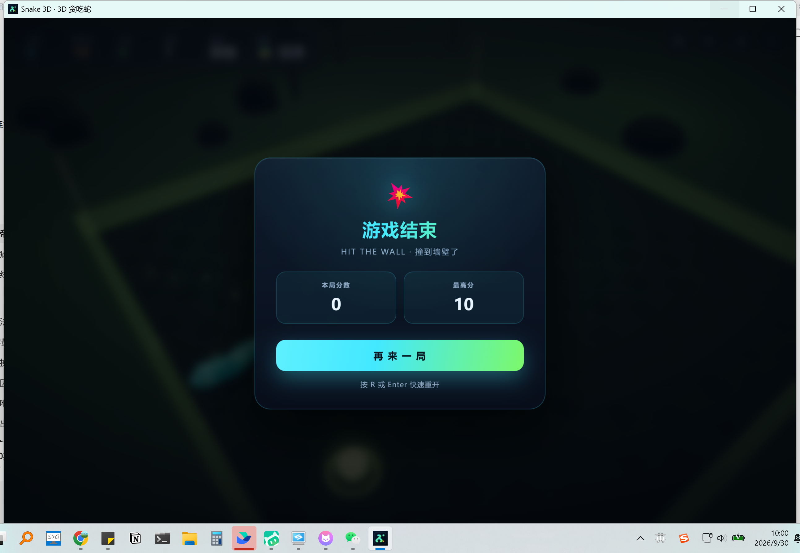

# 🐍 Snake 3D · 3D 贪吃蛇

用 Three.js 打造的 3D 贪吃蛇游戏 —— 网页版是零依赖单 HTML 文件，桌面版基于 **Tauri 2**（Rust + 系统 WebView），提供 Windows / macOS / Linux 三平台安装包。

<p align="center">
  
  &nbsp;
  
</p>

## ✨ 特性

- **真实 3D 渲染**：Three.js + WebGL，20×20 棋盘、发光能量球、实时阴影与粒子爆散特效
- **蛇形身体**：连续管状蛇身（非方块堆叠）——锥形轮廓、扁圆截面、背部鳞纹、爬行时的侧向行进波；蛇头带竖瞳、眉脊与分叉信子，转向会压弯
- **五张主题地图**：沙滩 / 火山 / 山林 / 沼泽 / 大海，每次重开随机换图——天空雾色、地面、水面（海面 / 岩浆 / 浊水）、灯光、食物配色、环境道具与氛围粒子整套切换
- **程序化配乐**：五套音阶 / 节奏 / 音色全部用 Web Audio 实时合成（无音频文件，离线可播），含反馈延迟混响与海浪、风声、岩浆轰鸣等噪声层
- **双视角**：跟随视角（W 前进、A/D 左右转向）与上帝视角（方向键即屏幕方向），`C` 一键切换
- **手感调校**：帧率无关的固定步长模拟 + 帧间插值，转向队列防止快速连按丢失输入
- **完整规则**：自撞判定含"尾部让位"细节、吃到食物随机刷新且不与蛇身重叠、逐级加速（12 档封顶），进食时能看到食物沿身体滑向尾部的吞咽鼓包
- **细节体验**：死亡震屏 + 红闪、8-bit 音效、失焦自动暂停、最高分本地存档
- **跨端**：网页版零依赖单文件；桌面版基于 Tauri 2，three.js 随包分发、完全离线，安装包体积仅个位数 MB

## 🎮 操作

| 按键 | 功能 |
| --- | --- |
| `W A S D` / `方向键` | 控制方向（跟随视角：W 前进、A/D 转向；上帝视角：即屏幕方向） |
| `空格` | 暂停 / 继续 |
| `C` | 切换视角（跟随 / 上帝） |
| `M` | 音效开关 |
| `N` | 背景音乐开关 |
| `R` / `Enter` | 重新开始（随机换一张地图） |

移动端：滑动屏幕或使用右下角虚拟方向键。

## 🚀 快速开始

### 网页版

`web/index.html` 是零依赖单文件，双击即可在浏览器中游玩（three.js 由 CDN 加载，首次需联网）。

也可以起一个本地服务：

```bash
cd web
python -m http.server 8080   # 或 npx serve .
```

### 桌面版

到 [Releases](https://github.com/ilses1/snake-3d-tauri/releases) 下载对应平台的安装包，无需自行编译：

| 平台 | 文件 | 说明 |
| --- | --- | --- |
| Windows | `Snake3D_*_x64-setup.exe` | NSIS 安装包，双击安装（当前用户级，无需管理员） |
| macOS | `Snake3D_*_universal.dmg` | 通用二进制，Intel 与 Apple 芯片通用 |
| Linux | `Snake3D_*_amd64.AppImage` / `Snake3D_*_amd64.deb` | AppImage 免安装通用；deb 适用于 Debian / Ubuntu |

<p align="center">
  
</p>

> 构建产物未做代码签名，首次打开可能被系统拦截：
> **Windows** 在 SmartScreen 提示中点「更多信息 → 仍要运行」；
> **macOS** 右键点击 App 选择「打开」，或执行 `xattr -cr /Applications/Snake3D.app`；
> **Linux** AppImage 需先 `chmod +x Snake3D-*.AppImage`。

#### 从源码构建

需要 [Rust 工具链](https://rustup.rs/) 与 [Node.js](https://nodejs.org/)（Linux 另需 `libwebkit2gtk-4.1-dev`、`libappindicator3-dev`、`librsvg2-dev`、`patchelf`）。

```bash
cd tauri-app
npm install                  # 安装 Tauri CLI
npm run sync                 # 由 web/index.html 生成 ui/（three.js 换成本地文件）
npm run dev                  # 开发模式直接运行
npm run build                # 打当前平台安装包
npx tauri build --bundles nsis          # Windows
npx tauri build --bundles deb,appimage  # Linux
npx tauri build --target universal-apple-darwin --bundles dmg   # macOS 通用包
```

> 桌面版把 three.js 随包分发，运行时**完全离线**；界面由系统 WebView 渲染，无需额外运行时（Windows 首次会自动安装 WebView2）。
> 一般不需要本地构建：推送 tag 后 GitHub Actions 会自动完成三平台打包并发布到 Release。

## 📁 目录结构

```
├── web/                        # 网页版（单 HTML 文件，CDN 引入 three.js）
├── tauri-app/                  # 桌面版（Tauri 2）
│   ├── src-tauri/              # Rust 侧：窗口配置、图标、构建脚本
│   │   └── tauri.conf.json
│   ├── vendor/three.module.js  # 随包分发的 three.js r161
│   ├── sync-ui.mjs             # 由 web/index.html 生成 ui/（ui 不入库）
│   └── package.json
├── docs/                       # 截图
└── .github/workflows/          # CI：打 tag 自动打包三平台安装包并发布 Release；web/ 变更自动部署 Pages
```

## 🛠 技术要点

- **模拟与渲染分离**：逻辑以固定步长推进（初始 175ms/步，随分数提速），渲染层对每节身体做帧间插值，任何刷新率下移动都平滑
- **连续蛇身网格**：每帧把离散格子中心串成折线 → 拐角二次贝塞尔圆角 → 等弧长重采样 → 写入预分配的管状 `BufferGeometry`（锥度 / 扁圆截面 / 顶点色鳞纹，解析法线免算 `computeVertexNormals`）
- **程序化音乐**：前瞻调度器按十六分音符排音（主旋律 / 双振荡器低音 / 噪声打击），只在音频上下文 `running` 且游戏进行中排音，避免浏览器无手势时积压音符
- **自撞判定**：蛇尾本回合会移开的格子不算碰撞（仅在吃食物增长时例外），这是经典贪吃蛇最容易写错的细节
- **镜头控制**：偏航角用最短角差插值（angleLerp），蛇急转弯时相机平滑跟随而非瞬间切换
- **桌面端技术栈**：Tauri 2（Rust 外壳 + 系统 WebView）承载同一份网页代码，安装包体积从 Electron 方案的 ~100 MB 降到个位数 MB，内存占用也更低

## 📦 发布新版本

```bash
git tag v1.0.2
git push origin v1.0.2     # CI 并行打包 Windows / macOS / Linux 并附到 GitHub Release
```

## License

[MIT](LICENSE)
